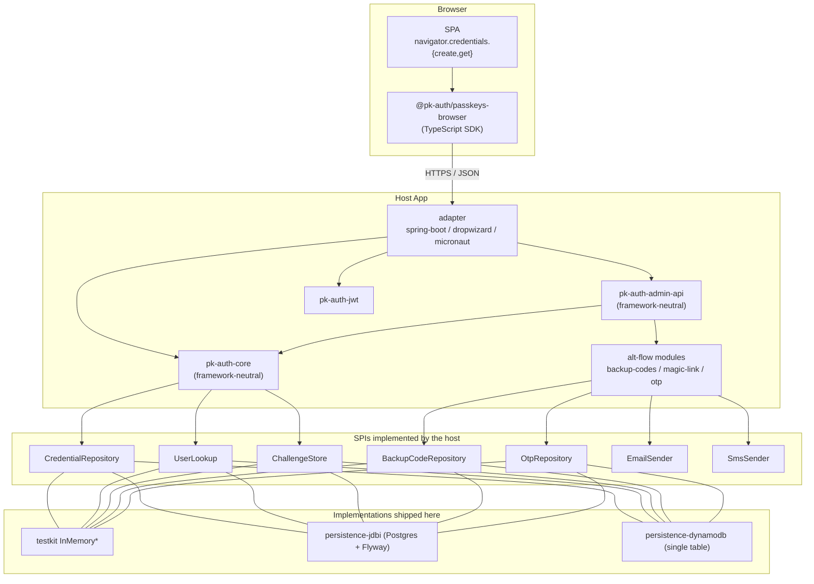

# pk-auth Design

This document is for a developer adopting pk-auth — or extending it.
It explains the architecture, the SPIs you implement to plug in your
own storage and dispatchers, the wire contract every adapter
exposes, and the conventions the codebase follows.

For specific topics:

- **What it does + how to run a demo** — [`README.md`](./README.md).
- **Per-decision rationale** — [`docs/adr/`](./docs/adr/) (16 ADRs,
  numbered).
- **Running it in production** — [`docs/operator-guide.md`](./docs/operator-guide.md).
- **Security posture** — [`docs/threat-model.md`](./docs/threat-model.md).
- **The original brief and phase plan** —
  [`pk-auth-build-brief.md`](./pk-auth-build-brief.md).

## 1. Mission

Build a passkey-first authentication template that's drop-in for any of
the three mainstream JVM web frameworks and is *intentionally boring*
about everything else: stateless JWT, configurable persistence, no
proprietary protocol on the wire, no required external SaaS.

Two non-goals worth surfacing up front:

- **pk-auth is not an identity provider.** It is the credential layer
  of *your* identity story. It does not own users — it stores
  passkeys and looks users up through your `UserLookup` SPI. See
  [ADR 0006](./docs/adr/0006-userlookup-spi-not-owned.md).
- **pk-auth does not implement attestation policy.** A pluggable
  hook (`AttestationTrustPolicy`) exists, but no MDS3 fetcher is
  bundled. Sites with FIDO-attestation requirements implement their
  own.

## 2. Architecture overview



The whole project is structured around three concentric rings:

1. **Core (framework-neutral, persistence-neutral).** Knows about
   WebAuthn, JWT, and the wire contract. Has no dependencies on
   Spring, Dropwizard, Micronaut, JDBC, DynamoDB, HTTP, or any
   servlet API. Exposes services and SPIs.
2. **SPIs (ports).** Interfaces the host implements:
   `CredentialRepository`, `UserLookup`, `ChallengeStore`,
   `BackupCodeRepository`, `OtpRepository`, `EmailSender`, `SmsSender`,
   `AttestationTrustPolicy`, `OriginValidator`, `ClockProvider`.
3. **Adapters.** Three of them — Spring Boot, Dropwizard, Micronaut.
   Each adapter mounts the same JSON contract under `/auth/**` and
   delegates to the core.

The dependency arrows always point *inward*: adapters depend on core,
core depends on no adapter. The persistence modules and alt-flow
modules implement SPIs declared in core and are wired in by the host.

## 3. Module layout

| Module | Purpose |
|---|---|
| `pk-auth-core` | Framework-neutral ceremony engine. `PasskeyAuthenticationService` is the entry point; `api/`, `spi/`, `config/`, and `lifecycle/` are exported. Hosts the `UserDeletionService` fan-out and `UserDeletionListener` SPI ([ADR 0016](./docs/adr/0016-user-deletion-fan-out.md)). |
| `pk-auth-jwt` | HS256 JWT mint (`PkAuthJwtIssuer`) + validate (`PkAuthJwtValidator`). Nimbus JOSE+JWT under the hood. Hosts the `TokenTtlPolicy` SPI for per-audience access-token TTL dispatch ([ADR 0014](./docs/adr/0014-per-audience-ttl-policy.md)) and the `AccessTokenStore` SPI for stateful (server-revocable) access tokens ([ADR 0015](./docs/adr/0015-stateful-access-tokens.md)). |
| `pk-auth-backup-codes` | Alt flow: generate, hash (Argon2id), and atomically claim view-once backup codes. |
| `pk-auth-magic-link` | Alt flow: random-token magic links over the host's email dispatcher. |
| `pk-auth-otp` | Alt flow: 6-digit OTPs over the host's SMS dispatcher; Argon2id-hashed and atomic-claim. |
| `pk-auth-refresh-tokens` | Rotating refresh tokens with family-based replay defense. `RefreshTokenService` + `RefreshTokenRepository` SPI; `RefreshHandler` is the framework-neutral `POST /auth/refresh` composer ([ADR 0013](./docs/adr/0013-refresh-tokens-family-rotation.md)). |
| `pk-auth-admin-api` | `AdminService` exposes account/credential/backup-code/email/phone operations. Result-typed (`AdminResult<T>` sealed sum). |
| `pk-auth-persistence-jdbi` | SPI impls on JDBI + Postgres + Flyway. Migrations at `src/main/resources/db/migration/`. |
| `pk-auth-persistence-dynamodb` | SPI impls on AWS SDK v2 DynamoDB Enhanced. Single table, schema per item-type ([ADR 0008](./docs/adr/0008-dynamodb-single-table-design.md)). |
| `pk-auth-testkit` | `FakeAuthenticator` for ceremony-driving tests + `InMemoryX` for every SPI. |
| `pk-auth-spring-boot-starter` | Spring Boot 4 / Spring Security 7 autoconfigure + controller. |
| `pk-auth-dropwizard` | Dropwizard 5 `ConfiguredBundle` + Dagger 2 wiring + Jersey resources. |
| `pk-auth-micronaut` | Micronaut 4 controllers + `@Filter` JWT validation (no Micronaut Security). |
| `clients/passkeys-browser` | TypeScript SDK (npm: `@pk-auth/passkeys-browser`). ESM + CJS, zero deps, vitest-tested. |
| `examples/{spring-boot,dropwizard,micronaut}-demo` | Runnable demos with the shared SPA. |

## 4. The wire contract

Every adapter mounts the same paths and consumes/produces the same
JSON shapes. The TypeScript SDK targets this contract; clients in
other languages can target it too — there's nothing
framework-specific on the wire.

### Ceremony endpoints (unauthenticated)

| Method | Path | Notes |
|---|---|---|
| `POST` | `/auth/passkeys/registration/start` | Returns `{challengeId, publicKey}` (WebAuthn creation options) |
| `POST` | `/auth/passkeys/registration/finish` | Persists the credential; returns the stored `CredentialSummary` |
| `POST` | `/auth/passkeys/authentication/start` | Returns `{challengeId, publicKey}` (WebAuthn request options) |
| `POST` | `/auth/passkeys/authentication/finish` | Mints a JWT; returns `{token}` |
| `POST` | `/auth/refresh` | Rotates a refresh token; returns `{refresh, access}` on success, `401 {detail}` on any failure. Only mounted when `pk-auth-refresh-tokens` is on the classpath and a `RefreshTokenRepository` SPI is bound. |

> The Dropwizard adapter mounts these one segment shorter
> (`/auth/registration/start`, etc.) because Dropwizard's bundle root
> path convention differs. The TypeScript SDK handles this via a
> per-client path override; see `clients/passkeys-browser/README.md`.

### Admin endpoints (require `Authorization: Bearer <jwt>`)

| Method | Path | Notes |
|---|---|---|
| `GET` | `/auth/admin/account` | Current user summary |
| `GET` | `/auth/admin/credentials` | List passkeys |
| `PATCH` | `/auth/admin/credentials/{id}` | Rename a passkey |
| `DELETE` | `/auth/admin/credentials/{id}` | Delete (enforces last-credential guard → 409) |
| `POST` | `/auth/admin/backup-codes/regenerate` | View-once plaintext batch |
| `GET` | `/auth/admin/backup-codes/count` | Remaining count |
| `POST` | `/auth/admin/email/start-verification` | Dispatch magic link |
| `POST` | `/auth/admin/email/complete-verification` | Consume token (no auth — recipient redeems via emailed link) |
| `POST` | `/auth/admin/phone/start-verification` | Dispatch OTP |
| `POST` | `/auth/admin/phone/complete-verification` | Verify OTP |

### Wire conventions

- **Bytes**: every byte field on the wire is **base64url, no padding**
  (RFC 4648 §5). The core's `PkAuthObjectMappers.pkAuthModule()`
  registers serializers/deserializers for `byte[]`, `UserHandle`, and
  `ChallengeId` so adapters using Jackson 3 get the right shape
  automatically. The Dropwizard adapter still rides Jackson 2 and uses
  a small bridge module (`PkAuthJacksonBridge`) for the same effect.
- **Errors**: `4xx` with a JSON body `{ "outcome": "<kind>", "error":
  "<kind>", "detail": "..." }`. `outcome` and `error` both carry the
  same machine-readable tag so clients keyed off either field keep
  working; `detail` is present only when the result variant carried
  one. Common kinds: `validation_failed`, `origin_mismatch`,
  `counter_regression`, `challenge_expired`, `conflict`, `forbidden`,
  `not_found`, `rate_limited`. `rate_limited` is paired with a
  `Retry-After` response header. The adapter `PkAuthAdminResultMapper`
  classes are the source of truth.
- **Idempotence**: `finish` endpoints are *not* idempotent — challenges
  are single-use (`ChallengeStore.takeOnce`).

## 5. Core types

Worth knowing for any non-trivial integration:

- **`UserHandle`** (`pk-auth-core/api`) — an opaque, stable byte
  identifier for a user. Generated on first-passkey registration; once
  bound to a passkey, must remain stable for that user across all
  future calls. Your `UserLookup` is responsible for the
  `(username, email) ↔ UserHandle` mapping. See
  [ADR 0006](./docs/adr/0006-userlookup-spi-not-owned.md).
- **`ChallengeId`** — a base64url-no-padding 32-byte token issued by
  `ChallengeStore.create` and atomically consumed by
  `ChallengeStore.takeOnce`. The atomicity is the only thing
  preventing challenge replay.
- **`AdminResult<T>` sealed sum** — every admin operation returns one
  of `Success<T> | NotFound | Forbidden | ValidationFailed | Conflict |
  RateLimited`. Adapters pattern-match this into HTTP status codes.
- **`RegistrationResult` / `AssertionResult`** — sealed sums returned
  by the core ceremony service. The adapter wraps these in
  `Response.ok(...)` on success or maps the explicit failure variants
  to the right HTTP code.

## 6. SPIs (what you implement)

If you adopt pk-auth, the SPIs are your only mandatory contact
surface. They are intentionally narrow.

| SPI | Required? | Notes |
|---|---|---|
| `UserLookup` | **Yes** | Maps `(username/email) ↔ UserHandle`. Atomic find-or-create on first registration. |
| `CredentialRepository` | **Yes** | Insert / list-by-user / update / delete / find-by-id. |
| `ChallengeStore` | **Yes** | `create(...)`, `takeOnce(challengeId)` — atomic single-use. |
| `BackupCodeRepository` | Only if backup codes are enabled | Hashed-storage CRUD + atomic claim. |
| `OtpRepository` | Only if phone OTP is enabled | Same shape as backup codes. |
| `EmailSender` | Only if magic-link is enabled | `send(to, subject, body)`. |
| `SmsSender` | Only if phone OTP is enabled | `send(phoneE164, body)`. |
| `AccessTokenStore` | Optional (paved road for revocability) | Stateful access tokens. Issuer calls `record` on issue, validator calls `exists` on every validate. Default `AccessTokenStore.noop()` preserves stateless behaviour. JDBI + DynamoDB implementations ship in-tree. See [ADR 0015](./docs/adr/0015-stateful-access-tokens.md). |
| `TokenTtlPolicy` | Optional | Per-audience access-token TTL dispatch. Static factories `TokenTtlPolicy.single(ttl)` and `TokenTtlPolicy.fixed(default, overrides)` cover the common cases. See [ADR 0014](./docs/adr/0014-per-audience-ttl-policy.md). |
| `RefreshTokenRepository` | Only if `pk-auth-refresh-tokens` is wired | Storage SPI for the rotating refresh-token primitive. Load-bearing `rotateAtomically` atomically marks the parent used and inserts the successor. JDBI, DynamoDB, and in-memory impls ship; the contract is enforced by a parity test suite that includes the 8-thread concurrent-rotation race test. See [ADR 0013](./docs/adr/0013-refresh-tokens-family-rotation.md). |
| `UserDeletionListener` | Optional (extension point) | Hook for the `UserDeletionService` fan-out. The library auto-registers listeners for credentials, backup codes, OTPs, access tokens, and refresh tokens; hosts add their own to clean up host-owned tables on user delete. See [ADR 0016](./docs/adr/0016-user-deletion-fan-out.md). |
| `RevocationCheck` | Optional | In-process deny-list for hosts that want fast invalidation of a small set of JTIs without persisting every issued token. Orthogonal to `AccessTokenStore`. |
| `AttestationTrustPolicy` | Optional | Default policy is `none`. Override to enforce MDS3 / specific AAGUID lists. |
| `OriginValidator` | Optional | Default is config-driven exact-match. Override for tenancy-aware origins. |
| `ClockProvider` | Optional | Default is `Clock.systemUTC()`. Override in tests. |

For a fresh project, the testkit's in-memory implementations let
you boot end-to-end without writing any SPI. For Phase-12-style
production, the `pk-auth-persistence-jdbi` or
`pk-auth-persistence-dynamodb` modules already implement the
storage SPIs against a real backend.

## 7. Wiring it up (per framework)

### Spring Boot 4

```java
// build.gradle.kts
implementation("io.codeheadsystems:pk-auth-spring-boot-starter:<version>")
implementation("io.codeheadsystems:pk-auth-persistence-jdbi:<version>")  // optional

// application.yml
pkauth:
  relying-party:
    id: example.com
    name: My App
    origins: ["https://example.com"]
  jwt:
    secret: "${PKAUTH_JWT_SECRET}"   # ≥ 32 bytes
```

The starter autoconfigures everything if all required SPIs resolve
(host or persistence module). Implement `UserLookup` as a Spring
`@Bean` against your user table — that's the only Spring-specific
thing.

### Dropwizard 5

```java
public class MyApp extends Application<MyConfig> {
  public void run(MyConfig cfg, Environment env) {
    PkAuthBundle<MyConfig> bundle = new PkAuthBundle<>(
        myPersistenceBindings(), myAdminService());
    bundle.run(cfg, env);  // mounts /auth/**
  }
}
```

Wiring is Dagger 2 (compile-time DI — see
[ADR 0004](./docs/adr/0004-dagger-for-dropwizard.md)). The bundle
expects your config to implement `HasPkAuthConfig`, and a
`PersistenceBindings` record describing which SPIs to plug in.

### Micronaut 4

```java
// Provide the SPIs as @Singleton beans; the controllers and JWT filter
// are autoloaded from the pk-auth-micronaut module.
@Factory
public class PersistenceFactory {
  @Singleton public CredentialRepository creds() { return new InMemoryCredentialRepository(); }
  // ... and so on for each SPI
}
```

The micronaut adapter intentionally does **not** use Micronaut Security
— a plain `@Filter` extracts and validates the JWT. The
generics-heavy `SecurityRule<R extends HttpRequest<?>>` surface didn't
pay for itself.

## 8. Persistence

Two real-backend modules ship in-tree, both implementing the same
SPIs.

### JDBI + Postgres ([ADR 0003](./docs/adr/0003-jdbi-over-jpa.md))

- Migrations under `pk-auth-persistence-jdbi/src/main/resources/db/migration/`
  (Flyway). The schema is hand-tuned for the SPI access patterns;
  no JPA / Hibernate.
- Tables: `users`, `credentials`, `challenges`, `backup_codes`, `otp_codes`
  (V1–V5, no `pkauth_` prefix), plus the append-only `pkauth_audit_events`
  table from V6. `V8__create_access_tokens.sql` and
  `V9__create_refresh_tokens.sql` add the stateful-access-token and
  refresh-token tables for the 1.1.0 SPIs.
  `PkAuthJdbiSchema.CURRENT_SCHEMA_VERSION` is `"9"`. Magic-link tokens are
  not persisted — the JWT itself is the credential; consumed JTIs live in a
  `ConsumedJtiStore` (in-memory by default, swap in a shared backend for
  multi-replica deployments).
- Atomic-claim operations (`takeOnce`, `BackupCodeRepository.consume`,
  `OtpRepository.consume`) use conditional `UPDATE ... WHERE consumed_at IS NULL`
  / `consumed = FALSE` and return `boolean` so the caller can detect a
  race-lost claim. Credential delete is a hard delete (V7 dropped
  `revoked_at` / `revoked_reason`); audit history lives in the
  `pkauth.credential.deleted` structured log event.

### DynamoDB single-table ([ADR 0008](./docs/adr/0008-dynamodb-single-table-design.md))

- One physical table, schema per item type via `DynamoDbTable<T>` on
  the AWS SDK v2 Enhanced client.
- TTL attribute `expiresAt` is honored on challenges, OTPs, and
  magic-links; 1.1.0 adds `access_tokens` and `refresh_tokens` items
  on the same table with the DynamoDB-native `ttl` attribute set from
  the row's `expiresAt` epoch second — provision TTL on the table.
- The refresh-token layout writes three items per token (primary
  jti / user-index / family-index) so listings, family-scorch, and
  user-fan-out delete can all be served by the same physical table.
- Atomic-claim uses conditional-write `ConditionExpression`s; failed
  conditions surface as `ConditionalCheckFailedException` and are
  mapped to `AdminResult.Conflict` / `Challenge.Expired`.

### Testkit (in-memory)

- `pk-auth-testkit` ships `InMemoryX` for every SPI. The example apps
  default to these so a fresh clone runs without external services.
- Backed by `ConcurrentHashMap`. Not durable across restarts. Not for
  production.

## 9. The TS SDK

`clients/passkeys-browser/` is a zero-dep TypeScript SDK that ships
both ESM and CJS bundles, published on npm as
[`@pk-auth/passkeys-browser`](https://www.npmjs.com/package/@pk-auth/passkeys-browser)
(`npm install @pk-auth/passkeys-browser`; its version tracks the pk-auth
server release it speaks to). Two clients:

- **`PkAuthCeremonyClient`** — full `register()` and `authenticate()`
  flows that wrap `navigator.credentials.{create,get}`, handling all
  the byte-array / base64url conversions for you.
- **`PkAuthAdminClient`** — admin operations against `/auth/admin/**`
  with bearer-token auth. Takes a `getToken: () => string | null`
  callback at construction so token storage stays in the consumer's
  hands.

```ts
const pk = new PkAuthClient({
  apiBase: "/",
  getToken: () => localStorage.getItem("pk-jwt"),
});
await pk.ceremonies.register({ username: "alice", label: "MacBook" });
const { token } = await pk.ceremonies.authenticate({ username: "alice" });
localStorage.setItem("pk-jwt", token);
```

The SDK's `dist/` is **not** committed — Gradle's
`:buildPasskeysBrowserSdk` task runs `npm ci && npm run build` to
produce the bundle before each demo's `processResources` copies it
into the demo's static resources. The vitest suite covers the
serializers and HTTP layer; ceremony / admin flows are covered
end-to-end by the demos' Playwright suites.

## 10. JWTs

The default mint is **HS256** with a configurable secret
(`pkauth.jwt.secret`, ≥ 32 bytes). One-hour TTL by default. Claims:

- `sub` — base64url-encoded `UserHandle`
- `iss` / `aud` — configurable per host; `aud` falls back to
  `JwtConfig.defaultAudience()` when the caller's `JwtClaims.audience`
  is null
- `iat` / `exp` — epoch seconds
- `amr` — authentication-method tag (passkey / backup-code /
  magic-link / otp / **refresh**)
- `username`, `display_name` — passthrough from `UserLookup`

JWT verification (in adapter filters / Micronaut filter / Dropwizard
authenticator) returns a `JwtVerificationResult` sealed sum —
`Success(JwtClaims)` or `Failure(kind, detail)`.

**Per-audience TTLs (1.1.0).** `JwtConfig.ttlPolicy: TokenTtlPolicy`
replaces the single `tokenTtl: Duration`. The default policy returns
the same TTL for every audience (`TokenTtlPolicy.single(ttl)`);
multi-client deployments wire a `fixed(default, overrides)` policy so
web / cli / mobile audiences can carry different access-token
lifetimes from a single issuer. The validator accepts any audience in
`defaultAudience ∪ ttlPolicy.knownAudiences()`. See
[ADR 0014](./docs/adr/0014-per-audience-ttl-policy.md).

**Stateful access tokens (1.1.0).** The original 0.x stance was
stateless-by-default with short TTLs as the mitigation
([ADR 0005](./docs/adr/0005-stateless-jwt-default.md)). 1.1.0 keeps
that default but adds the `AccessTokenStore` SPI: when wired, the
issuer records every JTI and the validator checks `exists` on every
request, so logout / admin revoke / password reset / user delete
invalidate the bearer well before `exp`. The default
`AccessTokenStore.noop()` keeps the legacy behaviour for hosts that
prefer it. The `RevocationCheck` SPI remains supported as a
lighter-weight deny-list orthogonal to the store. See
[ADR 0015](./docs/adr/0015-stateful-access-tokens.md).

**Refresh tokens (1.1.0).** The paved road for "session length
beyond one hour" is the rotating-refresh-token primitive shipped in
`pk-auth-refresh-tokens`. The wire token is `{refreshId}.{secret}`
(both halves base64url); the secret is SHA-256 hashed at rest. Every
`POST /auth/refresh` call is a single ceremony / one row per
rotation, with atomic mark-and-insert at the repository level and
family scorch on detected replay. The `RotateResult` sealed sum
(`Success | Replayed | Expired | Unknown | Revoked`) drives the
adapter response. See
[ADR 0013](./docs/adr/0013-refresh-tokens-family-rotation.md).

## 11. Security stance

The full STRIDE pass lives in [`docs/threat-model.md`](./docs/threat-model.md).
Highlights:

- **Origin validation is strict** by default with a config-driven
  allow-list. Mismatches reject with `origin_mismatch`.
- **Counter regression rejects** by default. Configurable to `warn`
  for sites where synced (counter-0) passkeys dominate, at the cost
  of weakening the clone-detection signal.
- **Challenges are single-use** and TTL-bounded (5 min default).
- **Backup codes and OTPs are Argon2id-hashed** server-side. Plaintext
  is returned only at regeneration time (view-once).
- **Last-credential guard**: `DELETE /credentials/{id}` returns 409
  if it would leave the user with zero passkeys. Backup codes are the
  intended recovery path; encourage users to add a second passkey
  before removing the first.
- **No PII is owned by pk-auth.** The `UserLookup` SPI is the only
  channel to user data; pk-auth never stores names, emails, or
  display names of its own.

## 12. Build system

Single Gradle multi-project build with conventions in
`build-logic/`:

- `pkauth.java-conventions` — JDK 21, Error Prone, JSpecify, no-`*`-import
  Spotless / google-java-format, `-Werror`.
- `pkauth.library-conventions` — JPMS `module-info.java` enforcement,
  Javadoc, jar manifest hygiene.
- `pkauth.test-conventions` — JUnit Jupiter, AssertJ, Mockito,
  Testcontainers wiring.
- `pkauth.publish-conventions` — Maven Central publishing. v1.0.0
  shipped through this path; see [`RELEASE.md`](./RELEASE.md) for the
  full release workflow.

JaCoCo enforces ≥ 80% line coverage on core, ≥ 70% on adapters.

The version catalog is `gradle/libs.versions.toml`; Dependabot
proposes bumps and is configured (`.github/dependabot.yml`) to ignore
specific traps (Micronaut 5.x needs JVM 25, Spotless 8.x has a
classloader bug, etc.). The Spring Boot 4 / Dropwizard 5 majors are
*not* pinned — they're treated as deliberate framework refreshes;
see commits `7b59f01` and `803ea5b` for the precedent.

## 13. Conventions

Worth knowing if you're contributing:

- **Records over classes** for DTOs, configs, and result variants.
  Sealed interfaces for closed sums (`AdminResult`,
  `JwtVerificationResult`, `RegistrationResult`).
- **Null discipline**: `@org.jspecify.annotations.NonNull` /
  `@Nullable` on every public method parameter and return type.
  JSpecify is loaded; Error Prone catches violations.
- **Public API is sealed** via `module-info.java` exports. Only `api`,
  `spi`, and `config` packages are exported per module.
- **No reflection in hot paths.** The only reflection is Jackson's,
  confined to (de)serialization boundaries.
- **Conventional commits** in commit messages; rationale for any
  non-trivial decision in either the commit body or an ADR.

## 14. Where to look next

- A specific algorithm or class? Start at the `api` / `spi` package
  of the relevant module — they're the contract surface.
- A specific operational concern? `docs/operator-guide.md`.
- A specific *why*? `docs/adr/` — every non-obvious decision has one.
- Anything else? `pk-auth-build-brief.md` is the original design
  document and is still authoritative for parts of the system that
  haven't yet drifted.
