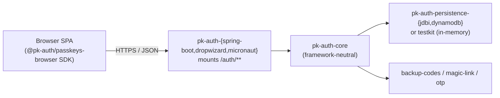

# pk-auth

A production-grade, **passkeys-first** authentication template for the JVM.
pk-auth ships as a reusable library set that can be dropped into a Spring
Boot, Dropwizard, or Micronaut application; the core is framework-neutral
and the host's user/credential storage is a plug-in SPI.

What you get out of the box:

- WebAuthn registration and assertion ceremonies — including multi-passkey
  enrolment and conditional UI — backed by WebAuthn4J.
- A stateless JWT mint at the end of authentication (HS256, configurable
  TTL).
- Account admin: list / rename / delete passkeys, regenerate
  view-once backup codes, account summary.
- Alternative-flow modules: backup codes, magic-link email verification,
  phone OTP verification — each behind a clean, host-implementable SPI.
- A framework-neutral admin service that every adapter mounts at the same
  paths so the same TypeScript SDK drives all three.
- Persistence options: in-memory (testkit), JDBI + Postgres with Flyway
  migrations, or DynamoDB single-table.
- A zero-dependency browser SDK (`@pk-auth/passkeys-browser`) covering
  both ceremony and admin operations.



For the full architecture, see [`DESIGN.md`](./DESIGN.md). For decision
records, see [`docs/adr/`](./docs/adr/). For production operations
guidance, see [`docs/operator-guide.md`](./docs/operator-guide.md) and
[`docs/threat-model.md`](./docs/threat-model.md). For SPI versioning and
stability guarantees, see [`docs/stability.md`](./docs/stability.md).
For transactional behavior across SPIs, see
[`docs/transactional-semantics.md`](./docs/transactional-semantics.md).

## Try it

The fastest path to a working demo:

```sh
./gradlew :examples:spring-boot-demo:run
```

Then open **http://localhost:8080** in a passkey-capable browser
(Chrome, Edge, Safari, Firefox 130+). The single-page UI exercises every
flow:

1. **Register** an account — your platform authenticator (Touch ID,
   Windows Hello, security key) handles the ceremony.
2. **Sign in** to get a JWT; the page decodes its claims at the bottom.
3. **List / rename / delete passkeys** — the demo enforces the
   last-credential guard.
4. **Regenerate backup codes** (view-once), check remaining count.
5. **Verify email via magic link** and **phone via OTP**.

Magic-link tokens and OTP codes are written to the **server console**
(the testkit ships `LoggingEmailSender` / `LoggingSmsSender`); copy them
from the gradle log back into the form to complete the verification
flows.

Two other demos exist for the other adapters — same UI, different
framework underneath:

```sh
./gradlew :examples:dropwizard-demo:run    # Jersey + Dropwizard 5
./gradlew :examples:micronaut-demo:run     # Netty + Micronaut 4
```

(Run one at a time — all three bind to port 8080.)

## Layout

```
pk-auth-core/                  # framework-neutral ceremony engine + SPIs
pk-auth-jwt/                   # HS256 JWT mint + validate
pk-auth-backup-codes/          # alt flow: Argon2id-hashed backup codes
pk-auth-magic-link/            # alt flow: email magic-link verification
pk-auth-otp/                   # alt flow: phone OTP verification
pk-auth-admin-api/             # framework-neutral admin operations
pk-auth-persistence-jdbi/      # SPI impls on JDBI + Postgres + Flyway
pk-auth-persistence-dynamodb/  # SPI impls on AWS DynamoDB Enhanced
pk-auth-testkit/               # FakeAuthenticator + in-memory SPIs
pk-auth-spring-boot-starter/   # adapter: Spring Boot 4 / Spring Security 7
pk-auth-dropwizard/            # adapter: Dropwizard 5 Bundle + Dagger 2
pk-auth-micronaut/             # adapter: Micronaut 4 controllers + filter
clients/passkeys-browser/      # TypeScript SDK (ESM + CJS)
examples/                      # runnable demos for each adapter
docs/                          # ADRs, operator guide, threat model
```

## Build

```sh
./gradlew check          # full lint + test + coverage gate
./gradlew clean build test
```

Requirements:

- **JDK 21** — Gradle's toolchain will fetch one if not present.
- **Node ≥ 20** + **npm** — for the browser SDK build, invoked
  automatically by Gradle (`./gradlew :buildPasskeysBrowserSdk`).

Optional, only needed for the JDBI / DynamoDB persistence integration
tests and Playwright end-to-end suites:

- **Docker** — Testcontainers spins Postgres and DynamoDB Local.
- **Chrome** — Playwright drives a CDP virtual WebAuthn authenticator.

## Status

Phases 0–12 complete (see `pk-auth-build-brief.md` §10 for the phase
plan). The library is feature-complete against the brief but is still
labelled **pre-1.0** — SPI signatures may change between minor versions
until 1.0. See [`docs/stability.md`](./docs/stability.md) for the full
versioning policy and the list of SPI surfaces. The full build and
end-to-end suites are green; the test classpath includes the testkit's
`FakeAuthenticator`, so registration + assertion ceremonies exercise the
real WebAuthn4J verifier without a browser.

**Known property — transactional boundaries:** pk-auth does not require
host SPIs to share a transactional context. At ceremony finish,
`ChallengeStore.takeOnce` is consumed before `CredentialRepository.save`.
If the save fails, the user must restart the ceremony from the beginning
(a new challenge is issued). This is intentional — challenges are
short-lived (5-minute default TTL), so a forced restart is acceptable and
avoids distributed-transaction complexity across heterogeneous SPI
implementations. See [`docs/transactional-semantics.md`](./docs/transactional-semantics.md)
for full details.

## License

MIT — see [`LICENSE`](./LICENSE).
