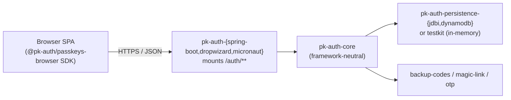

# pk-auth


A production-grade, **passkeys-first** authentication template for the JVM.
pk-auth ships as a reusable library set that can be dropped into a Spring
Boot, Dropwizard, or Micronaut application; the core is framework-neutral
and the host's user/credential storage is a plug-in SPI.

## Maven Central

All modules share the same version and `com.codeheadsystems` group id.

| Artifact ID | Version | Description |
|---|---|---|
| `pk-auth-core` | [](https://central.sonatype.com/artifact/com.codeheadsystems/pk-auth-core) | Framework-neutral SPIs, DTOs, and ceremony service. |
| `pk-auth-jwt` | [](https://central.sonatype.com/artifact/com.codeheadsystems/pk-auth-jwt) | HS256/ES256 JWT issuance + validation (Nimbus JOSE+JWT). |
| `pk-auth-admin-api` | [](https://central.sonatype.com/artifact/com.codeheadsystems/pk-auth-admin-api) | Framework-neutral admin service (list/rename/delete passkeys, etc.). |
| `pk-auth-backup-codes` | [](https://central.sonatype.com/artifact/com.codeheadsystems/pk-auth-backup-codes) | Argon2id-hashed one-time backup codes. |
| `pk-auth-magic-link` | [](https://central.sonatype.com/artifact/com.codeheadsystems/pk-auth-magic-link) | Single-use email magic-link tokens. |
| `pk-auth-otp` | [](https://central.sonatype.com/artifact/com.codeheadsystems/pk-auth-otp) | 6-digit SMS OTP codes for phone verification. |
| `pk-auth-refresh-tokens` | [](https://central.sonatype.com/artifact/com.codeheadsystems/pk-auth-refresh-tokens) | Rotating refresh tokens with family-based replay defense. *(1.1.0)* |
| `pk-auth-persistence-jdbi` | [](https://central.sonatype.com/artifact/com.codeheadsystems/pk-auth-persistence-jdbi) | JDBI 3 + Flyway + Postgres SPI implementations. |
| `pk-auth-persistence-dynamodb` | [](https://central.sonatype.com/artifact/com.codeheadsystems/pk-auth-persistence-dynamodb) | AWS SDK v2 DynamoDB Enhanced SPI implementations (single-table). |
| `pk-auth-testkit` | [](https://central.sonatype.com/artifact/com.codeheadsystems/pk-auth-testkit) | `FakeAuthenticator`, in-memory SPIs, and fixtures for tests. |
| `pk-auth-spring-boot-starter` | [](https://central.sonatype.com/artifact/com.codeheadsystems/pk-auth-spring-boot-starter) | Spring Boot 4 / Spring Security 7 auto-configure. |
| `pk-auth-dropwizard` | [](https://central.sonatype.com/artifact/com.codeheadsystems/pk-auth-dropwizard) | Dropwizard 5 `ConfiguredBundle` + Dagger 2 wiring. |
| `pk-auth-micronaut` | [](https://central.sonatype.com/artifact/com.codeheadsystems/pk-auth-micronaut) | Micronaut 4 `@Factory` + controllers + JWT filter. |

What you get out of the box:

- WebAuthn registration and assertion ceremonies — including multi-passkey
  enrolment and conditional UI — backed by WebAuthn4J.
- A stateless JWT mint at the end of authentication (HS256, configurable
  TTL) — or, with the 1.1.0 `AccessTokenStore` SPI, a stateful access
  token that's revocable before its `exp`.
- Per-audience JWT TTL dispatch via `TokenTtlPolicy` so web / cli /
  mobile clients can carry different access-token lifetimes from a single
  issuer.
- **Rotating refresh tokens with family-based replay defense** *(1.1.0)*
  — `POST /auth/refresh` is one ceremony / one row per rotation, with
  motif-style atomic mark-and-insert and family scorch on detected
  replay. The browser SDK's `PkAuthClient.refresh()` returns a typed
  result sum, never throws on 401. See
  [ADR 0013](./docs/adr/0013-refresh-tokens-family-rotation.md).
- Account admin: list / rename / delete passkeys, regenerate
  view-once backup codes, account summary.
- Alternative-flow modules: backup codes, magic-link email verification,
  phone OTP verification — each behind a clean, host-implementable SPI.
- A framework-neutral admin service that every adapter mounts at the same
  paths so the same TypeScript SDK drives all three.
- Persistence options: in-memory (testkit), JDBI + Postgres with Flyway
  migrations, or DynamoDB single-table.
- A zero-dependency browser SDK (`@pk-auth/passkeys-browser`) covering
  both ceremony and admin operations, published on npm
  (`npm install @pk-auth/passkeys-browser`). Its version tracks the
  pk-auth server release it speaks to.



For the full architecture, see [`DESIGN.md`](./DESIGN.md). For decision
records, see [`docs/adr/`](./docs/adr/). For production operations
guidance, see [`docs/operator-guide.md`](./docs/operator-guide.md) and
[`docs/threat-model.md`](./docs/threat-model.md). For SPI versioning and
stability guarantees, see [`docs/stability.md`](./docs/stability.md).
For transactional behavior across SPIs, see
[`docs/transactional-semantics.md`](./docs/transactional-semantics.md).

## Try it

The fastest path to a working demo:

```sh
./gradlew :examples:spring-boot-demo:run
```

Then open **http://localhost:8080** in a passkey-capable browser
(Chrome, Edge, Safari, Firefox 130+). The single-page UI exercises every
flow:

1. **Register** an account — your platform authenticator (Touch ID,
   Windows Hello, security key) handles the ceremony.
2. **Sign in** to get a JWT; the page decodes its claims at the bottom.
3. **List / rename / delete passkeys** — the demo enforces the
   last-credential guard.
4. **Regenerate backup codes** (view-once), check remaining count.
5. **Verify email via magic link** and **phone via OTP**.

Magic-link tokens and OTP codes are written to the **server console**
(the testkit ships `LoggingEmailSender` / `LoggingSmsSender`); copy them
from the gradle log back into the form to complete the verification
flows.

Two other demos exist for the other adapters — same UI, different
framework underneath:

```sh
./gradlew :examples:dropwizard-demo:run    # Jersey + Dropwizard 5
./gradlew :examples:micronaut-demo:run     # Netty + Micronaut 4
```

(Run one at a time — all three bind to port 8080.)

## Layout

```
pk-auth-core/                  # framework-neutral ceremony engine + SPIs
pk-auth-jwt/                   # HS256 JWT mint + validate, AccessTokenStore, TokenTtlPolicy
pk-auth-backup-codes/          # alt flow: Argon2id-hashed backup codes
pk-auth-magic-link/            # alt flow: email magic-link verification
pk-auth-otp/                   # alt flow: phone OTP verification
pk-auth-refresh-tokens/        # rotating refresh tokens with family-based replay defense
pk-auth-admin-api/             # framework-neutral admin operations
pk-auth-persistence-jdbi/      # SPI impls on JDBI + Postgres + Flyway
pk-auth-persistence-dynamodb/  # SPI impls on AWS DynamoDB Enhanced
pk-auth-testkit/               # FakeAuthenticator + in-memory SPIs
pk-auth-spring-boot-starter/   # adapter: Spring Boot 4 / Spring Security 7
pk-auth-dropwizard/            # adapter: Dropwizard 5 Bundle + Dagger 2
pk-auth-micronaut/             # adapter: Micronaut 4 controllers + filter
clients/passkeys-browser/      # TypeScript SDK (ESM + CJS)
examples/                      # runnable demos for each adapter
docs/                          # ADRs, operator guide, threat model
```

## Build

```sh
./gradlew check          # full lint + test + coverage gate
./gradlew clean build test
```

Requirements:

- **JDK 21** — Gradle's toolchain will fetch one if not present.
- **Node ≥ 20** + **npm** — for the browser SDK build, invoked
  automatically by Gradle (`./gradlew :buildPasskeysBrowserSdk`).

Optional, only needed for the JDBI / DynamoDB persistence integration
tests and Playwright end-to-end suites:

- **Docker** — Testcontainers spins Postgres and DynamoDB Local.
- **Chrome** — Playwright drives a CDP virtual WebAuthn authenticator.

## Status

1.0.0 cut the stable baseline; the current development line is
**1.1.0-SNAPSHOT**, which adds per-audience JWT TTLs, the
`AccessTokenStore` (stateful access tokens), the
`UserDeletionService` fan-out, and the `pk-auth-refresh-tokens`
module (rotating refresh tokens with family-based replay defense).
See [`CHANGELOG.md`](./CHANGELOG.md) for the full delta and
[`docs/stability.md`](./docs/stability.md) for the versioning policy
and the list of SPI surfaces. The full build and end-to-end suites
are green; the test classpath includes the testkit's
`FakeAuthenticator`, so registration + assertion ceremonies exercise
the real WebAuthn4J verifier without a browser.

**Known property — transactional boundaries:** pk-auth does not require
host SPIs to share a transactional context. At ceremony finish,
`ChallengeStore.takeOnce` is consumed before `CredentialRepository.save`.
If the save fails, the user must restart the ceremony from the beginning
(a new challenge is issued). This is intentional — challenges are
short-lived (5-minute default TTL), so a forced restart is acceptable and
avoids distributed-transaction complexity across heterogeneous SPI
implementations. See [`docs/transactional-semantics.md`](./docs/transactional-semantics.md)
for full details.

## License

MIT — see [`LICENSE`](./LICENSE).

<!-- Claude, do not edit anything below this line -->

# DISCLAIMER from the human

For this project development, I played the role of product manager and architect,
but let Claude write all of the code. If you do not like AI generated code, then
you will want to ignore this project. 

I will be verifying this project by using
it elsewhere in my work. The description of this git repository indicates if I
feel it is production worthy or not. I will also try to get legitimate security
folks to review it; but unless there is a note that they have reviewed the project,
assume it is not.
